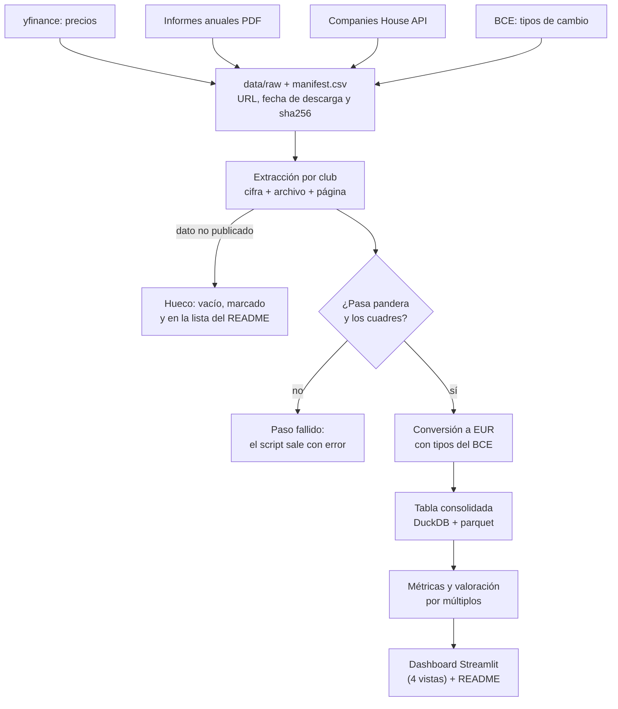

# Pitch to Balance Sheet · Plan del proyecto

Fase 0 cerrada el 25/09/2026. Este documento es el plan aprobado, con las decisiones de cierre ya incorporadas. Todas las fuentes se consultaron el 25/09/2026 salvo que se indique otra fecha.

## Decisiones tomadas al cerrar la fase 0

| # | Decisión |
| --- | --- |
| 1 | **Carpeta de trabajo:** `~/football-club-finance`. |
| 2 | **Universo por etapas:** primero los 8 cotizados y los 6 clubes ingleses no cotizados. Real Madrid, FC Barcelona y Atlético de Madrid entran después, cuando el pipeline funcione con los ingleses, y siempre con descarga manual. La valoración de Real Madrid y Barça va marcada como teórica. |
| 3 | **PDFs escaneados: primero se mide.** En la fase 2 se descarga un PDF de cuentas por club inglés y se mide cuánto texto saca pdfplumber. Si 3 o más de los 6 son imagen, se propone OCR solo para esos. Si no, los que sean imagen quedan como hueco. |
| 4 | **Dependencias añadidas al stack:** `python-dotenv` para leer `.env` y `PyYAML` para leer `config/`. |
| 5 | **La fase 1 se hace en Claude Code, en el Mac.** |

Supuestos del caso base que siguen en pie mientras no se cambien: temporadas 2021/22 a 2024/25 más 2025/26 cuando exista, año base 2024/25, fecha de valoración 30/06/2025 y sin prima de control.

## 1. Qué construimos

El proyecto reúne las cuentas de clubes europeos en una sola tabla y responde tres preguntas: qué clubes son financieramente sostenibles, cuánto pesan los salarios frente a los ingresos y cuánto valdría un club no cotizado comparado con los que cotizan.

- **Universo:** 8 cotizados, que hacen de comparables, y 6 ingleses no cotizados, que son los que se valoran. Después, 3 españoles.
- **Periodo:** de 2021/22 a 2024/25, más 2025/26 donde ya esté publicado. 2024/25 es el año base de la valoración porque es el último que todos los clubes tienen ya publicado.
- **Pieza central:** una tabla larga con una fila por club, temporada y concepto. Cada cifra lleva su fuente (archivo + página, o URL + fecha de descarga) y su conversión a EUR.

Orden de trabajo en la fase 2:

1. Medir la capa de texto de un PDF de cuentas por club inglés (decisión 3).
2. Extraer 2024/25 de todos los clubes, que es lo que desbloquea la valoración.
3. Completar hacia atrás hasta 2021/22 y añadir 2025/26 donde exista.
4. Con el pipeline funcionando con los ingleses, añadir Real Madrid, Barça y Atlético.

## 2. Reglas que aplican a todas las fases

- Solo fuentes públicas. Nada de scraping de Transfermarkt ni de webs cuyos términos lo prohíban. Donde robots.txt bloquea la descarga automática, descarga manual documentada.
- No se inventan ni se estiman cifras para rellenar huecos. Quedan vacías, marcadas y en la lista de huecos del README.
- Si un paso no se puede ejecutar (descarga fallida, PDF ilegible), el script sale con error y dice por qué.
- Cada cifra lleva su fuente. Todo en EUR, con el tipo de cambio y la fecha documentados.
- Ninguna clave en el código: van en `.env`, que está en `.gitignore`, y se deja un `.env.example` sin valores.
- Nada se instala de forma global y no se tocan archivos fuera de la carpeta del proyecto.
- Nada de machine learning: la valoración es por múltiplos y el razonamiento tiene que entenderse.
- El repo en GitHub y los push los hace el usuario.
- Antes de dar una fase por hecha: `ruff check .` y `pytest` con su salida real. En la fase 1, además, un commit de prueba con una clave falsa tipo `AKIA...` tiene que quedar bloqueado por gitleaks.

## 3. Estructura del repositorio

Sigue la estructura del brief (`src/`, `tests/`, `data/raw`, `data/processed`, `app/`) y añade `config/`, con los datos de cada club y las URLs fijadas, y `docs/`.

```text
football-club-finance/
├── pyproject.toml              # dependencias fijadas (incluye python-dotenv y PyYAML), config de ruff y pytest
├── .env.example                # COMPANIES_HOUSE_API_KEY= (sin valor)
├── .gitignore                  # .env, .venv/, .cache/, .tools/, data/raw/* salvo manifest.csv
├── .pre-commit-config.yaml     # gitleaks + ruff
├── .github/workflows/ci.yml    # ruff + pytest en cada push y PR
├── config/
│   ├── clubs.yaml              # club, país, ticker, nº Companies House, cierre fiscal, moneda
│   ├── sources.yaml            # URL fijada por club y temporada (+ descargas manuales)
│   └── line_items.yaml         # partida original → concepto normalizado
├── data/
│   ├── raw/                    # documentos tal cual (fuera de git) + manifest.csv
│   │   └── manual/             # PDFs descargados a mano donde no se permite la descarga automática
│   └── processed/              # parquet + football.duckdb
├── src/pitch_to_balance_sheet/
│   ├── cli.py                  # download | extract | validate | build
│   ├── sources/                # yfinance, companies_house, ir_reports, ecb_fx
│   ├── extract/                # utilidades PDF + un módulo por club
│   ├── schemas.py              # esquemas pandera
│   ├── fx.py                   # conversión a EUR
│   ├── build.py                # tabla consolidada
│   ├── metrics.py
│   └── valuation.py
├── app/                        # Streamlit: ranking, salud financiera, valoración, comparador
├── tests/
│   ├── fixtures/               # extractos reales de 1 página + respuestas de API grabadas
│   └── test_*.py
└── docs/
    ├── plan.md                 # este documento
    ├── estado.md               # estado del proyecto y pendientes
    └── ...                     # metodología y lista de huecos generada (fase 4)
```

## 4. Pipeline



Dos reglas atraviesan el flujo. Un paso que no puede ejecutarse (descarga fallida, PDF sin texto) para el script con error. Un dato que el club no publica no es un fallo: queda vacío, marcado y en la lista de huecos del README.

- **Reproducible sin subir PDFs:** `data/raw/` queda fuera de git salvo `manifest.csv`, que guarda URL, fecha y sha256 de cada descarga.
- **Descargas manuales:** van a `data/raw/manual/` y se registran igual en el manifiesto. El pipeline comprueba el sha256 y para si falta el archivo, diciendo cuál descargar y de qué URL.
- **CI sin red:** los tests usan fixtures grabados. La descarga real se ejecuta en local con `python -m pitch_to_balance_sheet download`.
- **URLs fijadas, no rastreo:** cada documento tiene su URL en `config/sources.yaml`. El pipeline no navega webs buscando enlaces.

## 5. Modelo de datos

Todo cae en una tabla larga, `fact_financials`, con una fila por club, temporada y concepto. Las métricas y la valoración se calculan después sobre ella, nunca sobre el PDF.

| Grupo | Columnas | Para qué |
| --- | --- | --- |
| Clave | `club_id`, `season`, `fiscal_year_end`, `concept` | Una sola fila por club, temporada y concepto |
| Cifra original | `label_original`, `value_reported`, `unit_reported`, `currency_reported` | La partida tal como aparece en el informe |
| Conversión | `fx_rate`, `fx_method`, `fx_date`, `value_eur` | Qué tipo se aplicó y por qué |
| Fuente | `source_file` + `source_page`, o `source_url` + `retrieved_at`; `sha256` | Archivo y página, o URL y fecha de descarga |
| Huecos | `is_gap`, `gap_reason` | Dato no publicado: valor vacío y motivo |

Conceptos de partida: `revenue_total`, `revenue_matchday`, `revenue_broadcasting`, `revenue_commercial`, `revenue_other`, `staff_costs`, `amortisation_player_registrations`, `impairment_player_registrations`, `profit_on_player_disposals`, `net_result`, `borrowings`, `lease_liabilities`, `cash`, `transfer_payables`, `transfer_receivables` y, para cotizados, `shares_outstanding`. Tablas de apoyo: `dim_club` (de `clubs.yaml`), `fx_rates` (BCE), `market_prices` (yfinance) y `line_item_map` (de `line_items.yaml`).

Convenciones:

- **Temporada = año fiscal que cierra en ella.** Un cierre a 30/06/2025 o a 31/05/2025 es `2024/25`. Arsenal y Liverpool cierran el 31 de mayo; el resto de clubes comprobados, el 30 de junio.
- **EUR con tipos de referencia del BCE** (serie `EXR.D.GBP.EUR.SP00.A` y equivalentes). Cuenta de resultados: media de los tipos diarios del año fiscal. Balance: tipo del día de cierre o el último anterior. Precios de mercado: tipo del mismo día. El BCE publica GBP por 1 EUR, así que se divide.
- **Unidades:** todo pasa a unidades monetarias completas antes de convertir, porque los informes vienen en miles o en millones.
- **`value_reported` es la cifra tal como la da el informe,** en su unidad: en miles si el informe va en miles, y en unidades si va en unidades, como el iXBRL de Lazio (146.041.028 euros). Se guarda exacta, sin redondear. Las tablas de revisión la muestran en miles redondeados.
- **Tolerancia de los cuadres, decidida el 27/09/2026 para todos los clubes:**
  - Tolerancia = max(1, floor(0,5 × número de filas sumadas)), en la unidad del documento, porque cada fila redondeada puede desviarse ±0,5. Por ejemplo, 1 con 2 o 3 filas y 4 con 8 o 9 filas.
  - Una igualdad entre dos celdas (el total de una nota y su línea en la cuenta, o la fuente y su control) cuenta como una fila: tolerancia 1.
  - Un cuadre que pasa con diferencia distinta de 0 lleva la marca "redondeo" y el número de filas. Las tablas dicen cuántos cuadres pasan por redondeo.
- **Reexpresiones:** la cifra de cada año sale de su propio informe. La comparativa del año siguiente sirve de control y se marca si difiere más de un 1%.
- **Validación con pandera:** tipos, lista cerrada de conceptos, clave única, fuente obligatoria cuando hay valor, motivo obligatorio cuando hay hueco y cuadre de las partidas de ingresos con el total, con tolerancia de redondeo.
- **Almacenamiento:** parquet en `data/processed/` y un `football.duckdb` que lee el dashboard.

## 6. Clubes cotizados

Los 8 tickers existen en yfinance y devolvieron precio del 25/09/2026. Solo Manchester United y Ajax tienen ya enlazado y descargable el PDF de 2025/26, y en 5 clubes el enlace no está en el HTML o la web bloquea la descarga automática.

| Club | Ticker | Cotiza en | Precio 25/09/2026 | Informe anual | Último FY enlazado | Idioma · moneda |
| --- | --- | --- | --- | --- | --- | --- |
| Manchester United plc | `MANU` | NYSE, USD | 20,415 | [Form 20-F](https://ir.manutd.com/~/media/Files/M/Manutd-IR/documents/2026-mu-plc-form-20-f.pdf) desde [IR](https://ir.manutd.com/financial-information/annual-reports/2026.aspx) | 2025/26 | Inglés · GBP |
| Juventus FC S.p.A. | `JUVE.MI` | Borsa Italiana, EUR | 1,929 | [Statements and Reports](https://www.juventus.com/en/club/investor-relations/statements/reports) | 2024/25; el de 2025/26 se aprueba el 29/09/2026 ([calendario](https://www.juventus.com/it/club/investitori/calendario-finanziario)) | Italiano · EUR |
| Borussia Dortmund GmbH & Co. KGaA | `BVB.DE` | Xetra, EUR | 3,165 | [Annual reports](https://aktie.bvb.de/en/publications/annual-reports-2), [PDF 2024/25](https://aktie.bvb.de/media/document/9eb897d3-91ac-48fa-a7b7-f0ed7eba1aff/assets/DE0005493092-JA-2024-EQ-E-00.pdf?disposition=inline) | 2024/25 | Alemán (vinculante) e inglés · EUR miles |
| Celtic plc | `CCP.L` | LSE AIM, GBp | 175,0 peniques | [Annual reports](https://www.celticfc.com/club/celtic-plc-investor-relations/celtic-plc-annual-reports/) y Companies House SC003487 | Resultados 2025/26 anunciados el 22/09/2026 ([nota](https://www.celticfc.com/news/2026/september/22/Celtic-plc-annual-results-for-year-ended-June-30--2026/)) | Inglés · GBP |
| AFC Ajax NV | `AJAX.AS` | Euronext Ámsterdam, EUR | 8,30 | [Jaarverslag 2025/26](https://www.ajax.nl/media/45peoljn/ajax-jaarverslag-2025_2026-def.pdf), [2024/25](https://www.ajax.nl/media/4tyefgaj/ajax-jaarverslag-2024_2025.pdf) | 2025/26, publicado el 25/09/2026 | Neerlandés · EUR |
| Benfica SAD | `SLBEN.LS` | Euronext Lisboa, EUR | 6,68 | [Contas anuais](https://www.slbenfica.pt/pt-pt/instituicao/sad/prestacao-de-contas/contas-anuais), [R&C 2024/25](https://media.slbenfica.pt/-/media/BenficaDP/Images/Instituicao/SAD/prestacao-de-contas/anuais/20251001-relatorio-contas-24-25) | 2025/26 listado el 08/09/2026, URL bloqueada por robots.txt | Portugués · EUR |
| FC Porto SAD | `FCP.LS` | Euronext Lisboa, EUR | 2,76 | Sin verificar: fcporto.pt devolvió 403 | Sin verificar | Portugués · EUR |
| S.S. Lazio S.p.A. | `SSL.MI` | Borsa Italiana, EUR | 1,66 | [Documenti](https://www.sslazio.it/en/investor-relators/documenti) | 2024/25, publicado el 07/10/2025 | Italiano · EUR |

Todos cierran el 30 de junio. En Porto se deduce de que su primer semestre es el de la temporada ([1.er semestre 2025/26](https://observador.pt/2026/02/18/fc-porto-sad-com-lucro-de-19-milhoes-de-euros-no-primeiro-semestre-de-2025-26/)) y queda por confirmar. Lo que cambia el diseño del pipeline:

- **Acciones desde el informe, no desde yfinance.** Para `MANU`, yfinance no devuelve ni el nombre ni el número de acciones. El 20-F de 2026 declara 56.143.220 acciones clase A y 116.348.173 clase B. La capitalización tiene que incluir ambas, aunque solo cotice la A.
- **Unidades de cotización:** Celtic cotiza en peniques (dividir entre 100) y `MANU` en dólares, aunque informa en libras.
- **Enlaces que no están en el HTML:** Juventus, Celtic y Lazio no tienen los enlaces a sus PDFs en el HTML, probablemente porque los cargan con JavaScript. La URL de cada PDF se fija una vez a mano en `sources.yaml`.
- **Plan B para los cotizados de la UE:** el informe en formato ESEF (Lazio lo enlaza en su página de documentos) y los registros oficiales de cada supervisor, como la CMVM para Benfica y Porto. Se comprueba en la fase 2.
- **Dortmund publica cuentas HGB e IFRS.** Se usan las IFRS de grupo, igual que en el resto.

## 7. Clubes no cotizados

### 7.1 Seis clubes ingleses (fase 2)

Los 6 tienen depositadas en Companies House sus cuentas de 2024/25. En la fase 0 la web pública devolvió 403 al descargar los PDFs, así que no se sabe si tienen capa de texto: se mide primero, con la API oficial.

| Club | Entidad que reporta (nº) | Cierre | Cuentas 2024/25 depositadas | Formato |
| --- | --- | --- | --- | --- |
| Arsenal | Arsenal Holdings Limited ([04250459](https://find-and-update.company-information.service.gov.uk/company/04250459)) | 31 de mayo | 27/02/2026, consolidadas, 45 páginas | Solo PDF |
| Chelsea | Chelsea FC Holdings Limited ([02536231](https://find-and-update.company-information.service.gov.uk/company/02536231)) | 30 de junio | 12/04/2026, consolidadas, 46 páginas | Solo PDF |
| Liverpool | The Liverpool Football Club and Athletic Grounds Limited ([00035668](https://find-and-update.company-information.service.gov.uk/company/00035668)) | 31 de mayo | 04/03/2026, consolidadas, 38 páginas | Solo PDF |
| Manchester City | Manchester City Football Club Limited ([00040946](https://find-and-update.company-information.service.gov.uk/company/00040946)) | 30 de junio | 06/03/2026, individuales, 39 páginas | Solo PDF |
| Tottenham Hotspur | Tottenham Hotspur Limited ([01706358](https://find-and-update.company-information.service.gov.uk/company/01706358)) | 30 de junio | 09/04/2026, consolidadas, 65 páginas | Solo PDF |
| Newcastle United | Newcastle United Limited ([02529667](https://find-and-update.company-information.service.gov.uk/company/02529667)) | 30 de junio | 13/04/2026, consolidadas, 47 páginas | Solo PDF |

**Medición de la capa de texto (decisión 3), primera tarea de la fase 2:**

1. Descargar con la Document API el PDF de cuentas 2024/25 de cada una de las 6 entidades.
2. Fijar por escrito, antes de medir, el criterio para llamar "imagen" a un PDF.
3. Medir con pdfplumber, página a página, los caracteres extraídos, y anotar el resultado por club en `docs/estado.md`.
4. Si 3 o más de los 6 son imagen, proponer OCR solo para esos y esperar el OK. Si son menos de 3, los que sean imagen quedan como hueco.

Además:

- **Criterio de entidad:** el grupo del club, no las sociedades de cartera que hay por encima (BlueCo 22 en Chelsea, UKSV Holdings en Liverpool), que pueden incluir deuda o activos ajenos al club. En Manchester City la matriz, Manchester City Limited (02989498), presentó en 2024/25 cuentas con exención de auditoría de 10 páginas, así que se usa la sociedad del club. Se revisa entidad por entidad en la fase 2.
- **Cómo llegan los datos:** API pública con clave gratuita, enviada como usuario de autenticación básica, con un límite de 600 peticiones cada 5 minutos ([guía](https://developer-specs.company-information.service.gov.uk/guides/rateLimiting)). Los documentos salen por la Document API, que indica en sus metadatos si hay PDF o XHTML y no funciona en el sandbox: hace falta una clave real ([referencia](https://developer-specs.company-information.service.gov.uk/document-api/reference)).
- **Cuándo llega 2025/26:** el propio registro fija el plazo el 28/02/2027 para Arsenal y Liverpool y el 31/03/2027 para el resto.
- **Celtic también está en Companies House** ([SC003487](https://find-and-update.company-information.service.gov.uk/company/SC003487)), útil como segunda fuente de un cotizado.

### 7.2 Tres clubes españoles (después, con descarga manual)

Entran cuando el pipeline funcione con los ingleses. Los tres se descargan a mano a `data/raw/manual/` y se registran en el manifiesto con URL, fecha y sha256. Los tres tienen públicas sus cuentas auditadas de 2024/25 y ninguno las de 2025/26.

| Club | Dónde publica | Nota |
| --- | --- | --- |
| Real Madrid C.F. | [Transparencia: cuentas anuales](https://www.realmadrid.com/es-ES/el-club/transparencia/cuentas-anuales) | Su robots.txt bloquea la ruta de los PDFs. Valoración marcada como teórica |
| FC Barcelona | [Información económica](https://www.fcbarcelona.es/es/club/transparencia/informacion-legal-institucional-y-economica), [cuentas 2024/25](https://www.fcbarcelona.com/fcbarcelona/document/2025/11/19/3dc8a7b9-ec0f-4844-9eb9-6cd8abc04961/Cuentas-anuales-y-auditor-a_CAST.pdf) | La capa de texto del PDF sale dañada en algunos puntos, con dígitos que faltan: cada cifra se revisa contra la página. Valoración marcada como teórica |
| Club Atlético de Madrid SAD | [Información económico-financiera](https://www.atleticodemadrid.com/atm/informacion-economica-financiera), [cuentas 2024/25](https://www.atleticodemadrid.com/pdf/cuentas_anuales_2025.pdf) | Su robots.txt bloquea `/pdf/` |

Real Madrid y Barça son propiedad de sus socios, así que su valoración es teórica y así aparece en el dashboard y en el README.

## 8. Regla UEFA y fuentes agregadas

El umbral vigente del squad cost ratio es el 70%. Lo fija el artículo 94.01 del reglamento UEFA de licencias y sostenibilidad financiera, edición 2026, en vigor desde el 1 de junio de 2026.

- **Texto literal:** "A licensee’s squad cost ratio for the licence season must be no greater than the defined limit of 70%." ([art. 94, ed. 2026](https://documents.uefa.com/r/UEFA-Club-Licensing-and-Financial-Sustainability-Regulations-2026/Article-94-Squad-cost-rule-Online)). La edición 2025, en vigor desde el 11/09/2025, decía lo mismo.
- **Transición:** 90% en 2023/24 y 80% en 2024/25 antes del 70% permanente desde 2025/26, según la [página de sostenibilidad financiera de la UEFA](https://www.uefa.com/running-competitions/integrity/financial-sustainability/), actualizada por última vez en julio de 2023.
- **Cálculo ([art. 93, ed. 2026](https://documents.uefa.com/r/UEFA-Club-Licensing-and-Financial-Sustainability-Regulations-2026/Article-93-Calculation-of-squad-cost-ratio-Online?contentId=VPXKGXvePkAdvYTaMMDQfQ)):** el numerador suma salarios de jugadores y primer entrenador, amortización de sus derechos, cesiones y agentes. El denominador suma ingresos operativos ajustados, resultado por venta de jugadores, deterioro de derechos y otros resultados de traspasos. Lo operativo cubre 12 meses a 31 de diciembre; lo de traspasos, 36 meses prorrateados a 12.
- **Qué significa para el repo:** con cuentas públicas no se puede replicar el ratio oficial. No se separan los salarios de jugadores del resto del personal, los años fiscales no son naturales y faltan los ajustes del anexo K. Se calcula un **SCR aproximado**, con ese nombre en todo el repo.
- **Prueba de cordura:** la UEFA sancionó a 9 clubes por superar el 70% en el año natural 2025, entre ellos Chelsea y Newcastle, que están en la lista ([UEFA, 30/06/2026](https://www.uefa.com/news-media/news/02a6-20fe598acc34-5b167fbb1b19-1000--finalisation-of-club-monitoring-for-the-2025-26-season/)). Si el proxy los deja muy por debajo, algo está mal. En esa misma revisión Juventus incumplió la regla de resultados (football earnings).
- **Premier League:** desde 2026/27 aplica su propio límite del 85% a los clubes que no juegan en Europa; los que juegan en Europa siguen con el 70% ([Premier League](https://www.premierleague.com/en/news/4467022/new-premier-league-financial-system-explained)). Se muestra como segunda línea de referencia para los ingleses.

| Informe | Edición | Qué se usa (solo agregados) |
| --- | --- | --- |
| [Deloitte Football Money League](https://www.deloitte.com/uk/en/services/consulting-financial/analysis/deloitte-football-money-league.html) | 2026 (29.ª), publicada el 22/01/2026, temporada 2024/25. Solo en web, sin PDF | Totales del top 20 y su reparto matchday / broadcast / commercial. La página dice que el top 20 generó "over €12 billion" por primera vez |
| [UEFA European Club Finance and Investment Landscape](https://ecfil.uefa.com/2025) | 2025, presentada el 26/02/2026 ([nota](https://www.uefa.com/news-media/news/02a2-200452a66064-0cfd3f86b94f-1000--new-report-highlights-record-revenues-and-increasing-inv/)), datos de 2024 y previsión de 2025 | Totales europeos de contexto: la UEFA cifra los ingresos de 2024 en 28.600 M€ y prevé superar 30.000 M€ en 2025 |

Ninguna cifra de club sale de estos dos informes: solo totales, cada uno citado con URL y fecha de consulta. Las cifras por club vienen siempre de sus propias cuentas.

## 9. Métricas y valoración

Cinco métricas por club y temporada, y una valoración por EV/ingresos que da un rango P25–P75 con la mediana como punto central. Los ingresos excluyen siempre la venta de jugadores.

**Regla de ingresos, decidida el 27/09/2026:**

- `revenue_total_reported`: los ingresos tal como los publica el club.
- `revenue_ex_player_trading`: `revenue_total_reported` menos las líneas de traspasos o cesiones que el club incluye en sus ingresos.
  - Si hay algo que restar, la cifra va marcada `is_derived=true`, con la fuente (página, fila y columna) de cada componente.
  - Si el club no incluye traspasos ni cesiones en los ingresos, es la misma cifra, sin derivar, y queda anotada la prueba: la columna de traspasos de la cuenta de resultados o la nota de ingresos.
  - Ejemplos de 2024/25: Juventus, 529.630 − 109.725 ("Proventi da gestione diritti calciatori"); Arsenal, 690,998 − 454 (player trading dentro de "Group turnover").
- **Las métricas usan `revenue_ex_player_trading`.**
- Cualquier cifra que se obtiene sumando o restando celdas publicadas también va marcada `is_derived=true`, con sus componentes. Por ejemplo, los gastos de personal de Juventus son la suma de los totales de las notas 40 y 41.

**Regla de personal, decidida el 27/09/2026:**

- `staff_costs`: el total de gastos de personal que publica el club. **Es el que usan las métricas.**
- `staff_costs_exceptional`: solo las indemnizaciones o rescisiones que el propio club clasifica como excepcionales, por ejemplo la nota 7.1 de Manchester United.
- `staff_severance_disclosed`: indemnizaciones que el club informa sin clasificarlas como excepcionales. Es un concepto informativo.
- Las dos llevan la columna `included_in_staff_costs`:
  - `true` o `false`, según estén dentro o fuera de `staff_costs`;
  - `dudoso` si las cuentas no lo dicen.
- Ninguna de las dos ajusta ninguna métrica.

**Reparto de ingresos y conceptos de jugadores (fase 3a, 27/09/2026):**

- **Mapeo:** `config/line_items.yaml` recoge cada partida original de ingresos de cada club, el concepto al que va (`revenue_matchday`, `revenue_broadcasting`, `revenue_commercial` o `revenue_other`) y el motivo.
- **Criterio del mapeo:** se sigue la agrupación del propio club cuando coincide con esas categorías, y los premios UEFA van a broadcasting.
- **Partida dudosa:** una partida propia que podría ir a más de un concepto (retail o merchandising, "other commercial", hospitality o catering sueltos, premios FIFA fuera de broadcasting...). Queda sin concepto y con sus candidatos hasta que decida el usuario; mientras tanto, esos conceptos son hueco.
- **Hueco:** un concepto al que no va ninguna partida.
- **Validación con pandera:** matchday + broadcasting + commercial + other, más las partidas pendientes, tiene que ser `revenue_ex_player_trading`, con la tolerancia de redondeo de la sección 5. Si no cuadra, la extracción sale con error.
- **Build:** una partida sin mapear la rompe. Las partidas de cada club tienen que sumar el total publicado.
- **`amortisation_player_registrations`:** la amortización del año de los derechos de jugadores.
- **`impairment_player_registrations`:** su deterioro. Si el club no lo separa, es hueco con motivo.
- **`profit_on_player_disposals`:** el beneficio neto por la venta de derechos de jugadores, tal como lo publica el club (plusvalías menos minusvalías y, según el club, costes de venta). No incluye cesiones ni otros ingresos de jugadores.

**Resultado neto, decidido el 27/09/2026:** `net_result` es el resultado consolidado total, con los minoritarios. `net_result_attributable_parent`, lo atribuible a la matriz, es informativo y se guarda en los clubes que lo publican.

| Métrica | Definición | Si falta un dato |
| --- | --- | --- |
| Mix de ingresos | matchday, broadcasting y commercial sobre ingresos totales. Premios UEFA en broadcasting | Hueco si el club no desglosa |
| Salarios / ingresos | gastos de personal totales / ingresos | Hueco |
| SCR aproximado | fórmula de abajo, desde 2023/24 | Hueco si faltan la amortización de jugadores o 3 años de traspasos |
| Deuda neta / ingresos | (deuda financiera + arrendamientos − caja) / ingresos; variante que suma saldos netos por traspasos | Hueco |
| EV / ingresos y bolsa (cotizados) | capitalización de todas las clases de acciones + deuda neta, sobre ingresos; rentabilidad total indexada a 100 | Hueco |

El SCR aproximado imita la estructura de la UEFA: el resultado de traspasos se promedia a 3 años. No separa los salarios de jugadores y usa año fiscal, por eso es aproximado.

```math
\text{SCR}_{\text{aprox}} = \frac{\text{gastos de personal} + \text{amortización de derechos de jugadores}}{\text{ingresos} + \overline{(\text{resultado por traspasos} - \text{deterioro de derechos})}_{3\ \text{años}}}
```

Valoración por comparables:

```math
\text{EV}_{\text{par}} = \text{precio} \times \text{acciones} + \text{deuda neta}, \qquad m_{\text{par}} = \frac{\text{EV}_{\text{par}}}{\text{ingresos}_{\text{par}}}
```

```math
\text{EV}_{\text{objetivo}} \in \big[\, P_{25}(m),\ P_{75}(m) \,\big] \times \text{ingresos}_{\text{objetivo}}, \qquad \text{Equity}_{\text{objetivo}} = \text{EV}_{\text{objetivo}} - \text{deuda neta}_{\text{objetivo}}
```

Supuestos explícitos del caso base:

1. **Fecha de valoración 30/06/2025.** Coincide con el balance 2024/25 de casi todos. Los precios de ese día van con los ingresos y la deuda del mismo cierre. La vista "hoy" sale como sensibilidad.
2. **Solo EV/ingresos.** El EBITDA deja fuera la amortización de fichajes, que es la principal inversión de un club, y oscila con las ventas de jugadores de cada año. EV/EBITDA compararía cosas distintas.
3. **Sin prima de control.** Los precios de bolsa son de participaciones minoritarias. El rango dice "lo que pagaría el mercado por una participación minoritaria comparable", no lo que costaría comprar el club entero.
4. **Sensibilidades:** todos los pares frente a los de mayor tamaño, deuda neta con y sin traspasos, y fecha de valoración.
5. **Si falta un dato de un par, ese par sale del cálculo** y se anota en la lista de huecos. No se rellena.
6. **Real Madrid y Barça:** su valoración se calcula igual, pero va marcada como teórica en todas las salidas.

En la fase 3 cada fórmula tiene un test con un caso calculado a mano, y el dashboard muestra el rango de cada club objetivo en un gráfico de barras de rango (football field).

## 10. Riesgos y mitigaciones

El riesgo que más puede cambiar el proyecto es que las cuentas inglesas sean imágenes escaneadas: sin ellas no hay clubes que valorar. Por eso la medición de la sección 7.1 va lo primero en la fase 2.

| Riesgo | Evidencia en la fase 0 | Mitigación |
| --- | --- | --- |
| Cuentas inglesas sin capa de texto | Companies House solo ofrece "View PDF" en las 6 entidades. Los 6 PDFs devolvieron 403 desde la web pública | Medición de la sección 7.1. Con 3 o más de 6 en imagen, propuesta de OCR solo para esos; si no, hueco |
| Webs que no permiten la descarga automática | robots.txt bloquea los PDFs de Real Madrid, Atlético y Benfica 2025/26; fcporto.pt dio 403; Juventus, Celtic y Lazio no tienen los enlaces en el HTML | No se automatiza donde no está permitido. Descarga manual a `data/raw/manual/` con URL, fecha y sha256 en el manifiesto; el pipeline comprueba el hash y para si falta el archivo |
| Formatos distintos | 6 idiomas, miles o millones, `1.234,5` frente a `1,234.5`, negativos entre paréntesis, HGB e IFRS en Dortmund | Un extractor por club anclado a página y rótulo, test con un fixture real y cuadre de subtotales |
| Clasificar ingresos es una decisión | Cada club agrupa sus ingresos a su manera | `line_items.yaml` con cada partida original, su destino y el motivo. Una partida sin mapear rompe la build |
| El SCR público no es el de la UEFA | Salarios de todo el personal, año fiscal y sin ajustes del anexo K | Nombre "aproximado", fórmula publicada y contraste con los sancionados por la UEFA. Nunca se dice que un club incumple |
| Pocos comparables y poco líquidos | 8 cotizados, casi todos pequeños y con accionista de control, como [Exor en Juventus](https://www.exor.com/press-releases/2025-12-13/exor-board-unanimously-rejects-tethers-proposal-acquire-exors-controlling). Solo `MANU` juega en la Premier | Rango en vez de punto, sensibilidad por grupo de pares y aviso de que no hay prima de control |
| yfinance es frágil | No es una API oficial. Para `MANU` no devolvió nombre ni acciones y con pandas 3 lanza avisos de funciones obsoletas | Solo precios, con fecha de descarga. Acciones desde los informes, versiones fijadas y CI sin red |
| Python del Mac sin verificar | La fase 0 midió la máquina virtual Linux de Cowork (Python 3.10.12), no el Mac. El brief pide 3.11 o superior | Primer paso de la fase 1: `python3 --version` en el Mac. Si es menor de 3.11, se decide con el usuario cómo instalarlo sin tocar nada global |
| El hook de gitleaks necesita Go | Probado en un entorno sin Go: pre-commit descargó el suyo (329 MB de caché) y bloqueó un commit con dos claves falsas | `PRE_COMMIT_HOME` dentro del proyecto. Si pesa demasiado, binario de gitleaks en `.tools/` con un hook local |
| Derechos de autor y uso de informes de terceros | Informes anuales, Money League y UEFA tienen copyright | No se suben PDFs. Fixtures de una página con atribución. De Deloitte y UEFA, solo totales citados de la edición pública y nada de material interno |
| Calendario y alcance | Juventus aprueba 2025/26 el 29/09/2026 y los ingleses lo depositan hasta marzo de 2027. Son 14 clubes ahora y 17 con los españoles, con 4 o 5 temporadas de PDFs | Año base 2024/25 para todos. Después, hacia atrás y 2025/26 cuando exista, sin mezclar años en la valoración. Los españoles, solo cuando funcionen los ingleses |

## 11. Entorno y herramientas

La fase 1 se hace en Claude Code, en el Mac.

- **Todo dentro de la carpeta:** entorno virtual en `.venv/`; cachés en `.cache/` (`PIP_CACHE_DIR=.cache/pip`, `PRE_COMMIT_HOME=.cache/pre-commit`); `.venv/`, `.cache/` y `.tools/` en `.gitignore`.
- **CI:** GitHub Actions con ruff y pytest en cada push y PR, sin red. El test que falla a propósito se ve en rojo cuando el usuario haga push, y después se quita.
- **gitleaks:** se probó el hook oficial v8.28.0. En la fase 1 conviene comprobar si hay una versión más reciente con `pre-commit autoupdate`.

Versiones publicadas a 25/09/2026, comprobadas en un entorno de prueba en la nube, no en el Mac. Sirven de referencia para fijar `pyproject.toml`:

| Paquete | Versión | Nota |
| --- | --- | --- |
| pandas | 3.0.6 | |
| pandera | 0.33.1 | Validó un esquema de prueba con pandas 3.0.6 |
| pdfplumber | 0.11.10 | |
| duckdb | 1.5.5 | |
| yfinance | 1.7.0 | Publicada el 26/08/2026. Sustituye a la 0.2.66 (17/09/2025), que daba avisos de funciones obsoletas con pandas 3 |
| requests | 2.34.2 | |
| plotly | 7.1.0 | |
| streamlit | 1.64.0 | |
| pytest | 9.1.1 | |
| ruff | 0.16.9 | |
| pre-commit | 4.6.2 | |
| python-dotenv, PyYAML | 1.2.3 y 6.0.3 | Añadidos por la decisión 4 y fijados en la fase 1 |

## 12. Verificaciones hechas en la fase 0

Salida real, recortada a las columnas útiles.

```text
# Máquina virtual Linux de Cowork en el Mac, carpeta conectada. Solo lectura.
$ uname -srm; ls -la; git rev-parse --is-inside-work-tree; python3 --version; command -v pre-commit gitleaks ruff uv
Linux 6.8.0-138-generic aarch64
total 4   (solo . y ..: carpeta vacía)
fatal: not a git repository
Python 3.10.12
pre-commit: no | gitleaks: no | ruff: no | uv: /usr/local/bin/uv | go: no | docker: no
$ curl pypi.org / github.com  ->  pypi 200 | github 200

# Entorno de prueba en la nube. Nada de esto se instaló en el Mac.
$ python verify_tickers.py        # yfinance 0.2.66, run_utc 2026-09-25T18:15:18+00:00
MANU     | None                                     | exch=NYQ | cur=USD | last=20.415 on 2026-09-25 | sharesOut=None
JUVE.MI  | Juventus Football Club S.p.A.            | exch=MIL | cur=EUR | last=1.929 on 2026-09-25 | sharesOut=417033996
BVB.DE   | Borussia Dortmund GmbH & Co. Kommanditgesellschaft auf | exch=GER | cur=EUR | last=3.165 on 2026-09-25 | sharesOut=110377320
CCP.L    | Celtic plc                               | exch=LSE | cur=GBp | last=175.0 on 2026-09-25 | sharesOut=95089919
AJAX.AS  | AFC Ajax NV                              | exch=AMS | cur=EUR | last=8.3 on 2026-09-25 | sharesOut=18333333
SLBEN.LS | Sport Lisboa e Benfica - Futebol, SAD    | exch=LIS | cur=EUR | last=6.68 on 2026-09-25 | sharesOut=23000000
FCP.LS   | Futebol Clube do Porto - Futebol, S.A.D. | exch=LIS | cur=EUR | last=2.76 on 2026-09-25 | sharesOut=22499900
SSL.MI   | S.S. Lazio S.p.A.                        | exch=MIL | cur=EUR | last=1.66 on 2026-09-25 | sharesOut=67738911

$ git commit -qm "test leak"       # repo de prueba, hook gitleaks v8.28.0, Go quitado del PATH
RuleID:      generic-api-key
RuleID:      aws-access-token
WRN leaks found: 2
commit_exit=1                     # commit bloqueado
329M  .cache/pre-commit
```

Los números de acciones de yfinance que aparecen arriba no se usan: las acciones salen de los informes.

## Fuentes

Consultadas el 25/09/2026.

- UEFA, Club Licensing and Financial Sustainability Regulations, ed. 2026: [art. 94](https://documents.uefa.com/r/UEFA-Club-Licensing-and-Financial-Sustainability-Regulations-2026/Article-94-Squad-cost-rule-Online) y [art. 93](https://documents.uefa.com/r/UEFA-Club-Licensing-and-Financial-Sustainability-Regulations-2026/Article-93-Calculation-of-squad-cost-ratio-Online?contentId=VPXKGXvePkAdvYTaMMDQfQ)
- UEFA, [Financial sustainability](https://www.uefa.com/running-competitions/integrity/financial-sustainability/)
- UEFA, [Finalisation of club monitoring for the 2025/26 season](https://www.uefa.com/news-media/news/02a6-20fe598acc34-5b167fbb1b19-1000--finalisation-of-club-monitoring-for-the-2025-26-season/) (30/06/2026)
- Premier League, [New Premier League financial system explained](https://www.premierleague.com/en/news/4467022/new-premier-league-financial-system-explained)
- Deloitte, [Football Money League 2026](https://www.deloitte.com/uk/en/services/consulting-financial/analysis/deloitte-football-money-league.html) y [nota de prensa](https://www.deloitte.com/uk/en/about/press-room/real-madrid-tops-deloitte-football-money-league.html)
- UEFA, [The European Club Finance and Investment Landscape 2025](https://ecfil.uefa.com/2025) y [nota del 26/02/2026](https://www.uefa.com/news-media/news/02a2-200452a66064-0cfd3f86b94f-1000--new-report-highlights-record-revenues-and-increasing-inv/)
- Companies House: [autenticación](https://developer-specs.company-information.service.gov.uk/guides/authorisation), [límites](https://developer-specs.company-information.service.gov.uk/guides/rateLimiting), [Document API](https://developer-specs.company-information.service.gov.uk/document-api/reference) y las fichas de cada sociedad enlazadas en la sección 7.1
- BCE: [API de datos](https://data.ecb.europa.eu/help/api/data) y [serie EXR.D.GBP.EUR.SP00.A](https://data.ecb.europa.eu/data/datasets/EXR/EXR.D.GBP.EUR.SP00.A)
- Exor, [nota del 13/12/2025 sobre la propuesta de Tether](https://www.exor.com/press-releases/2025-12-13/exor-board-unanimously-rejects-tethers-proposal-acquire-exors-controlling)
- Páginas de inversores y cuentas de cada club: enlazadas en las secciones 6 y 7
